# 🤖 AI Learning Workspace

Welcome to the **AI Learning Workspace**! This repository acts as a playground and educational space for experimenting with modern AI architectures, Large Language Models (LLMs), stateful agents, and Retrieval-Augmented Generation (RAG).

## 🚀 Projects Included

### 1. [PDF Q&A Agent (`pdf_qa_agent`)](./pdf_qa_agent/)
A local Retrieval-Augmented Generation (RAG) based project that allows you to chat with PDF documents.
- **Key Concepts:** Document Ingestion, Text Chunking, Embeddings, In-Memory Vector Stores, and Context Injection.
- **Technologies:** `langchain`, `faiss-cpu`, `sentence-transformers`, `pypdf`, Groq API.

### 2. [Weather Agent (`weather_agent`)](./weather_agent/)
A fully functional conversational AI that dynamically runs tool/function calls based on a specific user's ID context.
- **Key Concepts:** Graph-based State Management, Tool Execution, the "Backpack" Context Pattern, and Chat Memory.
- **Technologies:** `langgraph`, `langchain-groq`.

---

## 📽️ How They Work (Workflow "Animation")

The sequence diagram below visually animates the two core paradigms (RAG vs Stateful Tool Calling) explored in this workspace:

```mermaid
sequenceDiagram
    actor User
    participant RAG as RAG Pipeline (PDF) 📄
    participant Agent as LangGraph Agent (Weather) 🌤️
    participant LLM as Groq LLM (Llama 3) 🧠
    
    %% RAG Workflow
    rect rgb(30, 40, 50)
    note right of User: Paradigm 1: RAG (pdf_qa_agent)
    User->>RAG: "What is the main topic of my PDF?"
    RAG->>RAG: 1. Vector Search across chunks<br/>2. Retrieve Top-3 relevant pages
    RAG->>LLM: Inject chunks as context + Prompt
    LLM-->>RAG: Generates Grounded Answer
    RAG-->>User: Delivers Answer & Sources
    end

    %% Agent Workflow
    rect rgb(30, 50, 40)
    note right of User: Paradigm 2: Agents (weather_agent)
    User->>Agent: "What's the weather for me?"
    Agent->>Agent: Retrieve User ID from Context
    Agent->>LLM: Checks if tool execution is needed
    LLM-->>Agent: Action: Call `get_user_location()`
    Agent->>LLM: Feed location back to model
    LLM-->>Agent: Action: Call `get_weather()`
    Agent-->>User: Delivs Real-Time API Response
    end
```



---

## 🛠️ Preparation & Setup

Each project directory contains a separate environment, setup logic, and dependencies. Keep the following preparation steps in mind:

1. **API Keys:** Both projects utilize incredibly fast inference powered by **Groq**. You will need a `GROQ_API_KEY` to successfully run them. 
2. **Environment Variables:** Make sure to create a `.env` file within the specific project directory you are running:
   ```env
   GROQ_API_KEY=your_api_key_here
   ```
3. **Run Commands:** Follow the personalized `README.md` instructions inside each project to install their packages (such as running `uv run main.py`).
