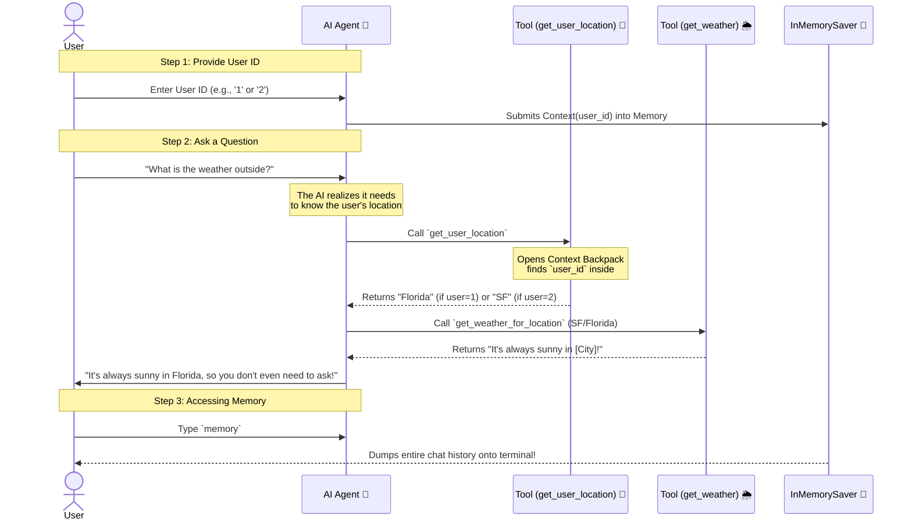

# 🌤️ AI Weather Agent with LangGraph

Welcome to the AI Weather Agent! This application is a fully functional conversational AI that dynamically retrieves the weather based on a user's ID using **LangChain**, **LangGraph**, and **Groq**. 

## 🚀 Setup & Preparation

Follow these steps to get everything running smoothly:

### 1. Install Dependencies
You will need to install the required Python packages:
```bash
pip install langchain langgraph langchain-groq python-dotenv
```

### 2. Environment Variables
Create a `.env` file in the root of your project and add your GROQ API key:
```env
GROQ_API_KEY=your_groq_api_key_here
```

### 3. Run the Agent
Run the main script using Python. 
```bash
python weather_agent.py
```

---

## 📽️ How It Works (Agent Workflow "Animation")

The diagram below visually animates the step-by-step communication between you, the AI, and its dynamic tools during a conversation.



---

## 🎒 The "Backpack" Context Pattern
This project uses a powerful **Context Schema** to pass variables. 

Instead of polluting the AI's prompt with secret or internal system variables (like user IDs), we define a `@dataclass Context`, and safely pass it directly into our Tools behind the scenes! This makes the agent both **safe** and **dynamic**.
